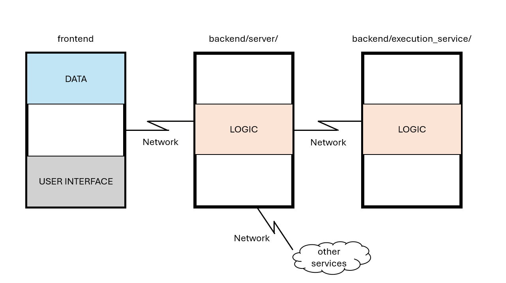

# DeepBlocks: a web application for creating DNN

## Repository organization
- Frontend developed with ReactJS
- Backend:
  - Flask server (GRPC client) (`server/`)
  - GRPC server (`execution_service/`)

## Architecture


## Instructions
In order to run the application, you need to have installed `python3` and `node.js`.

To run the application, open 3 terminal windows:
- in the first one, run:
  ```sh
  cd frontend; npm install; npm run dev
  ```
- in the second one, run:
  ```sh
  cd backend; cd server; python -m venv venv; venv/Scripts/activate; pip install -r requirements.txt; python main.py
  ```
- in the third one, run:
  ```sh
  cd backend; cd execution_service; python -m venv venv; venv/Scripts/activate; pip install -r requirements.txt; python execution_service.py
  ```
